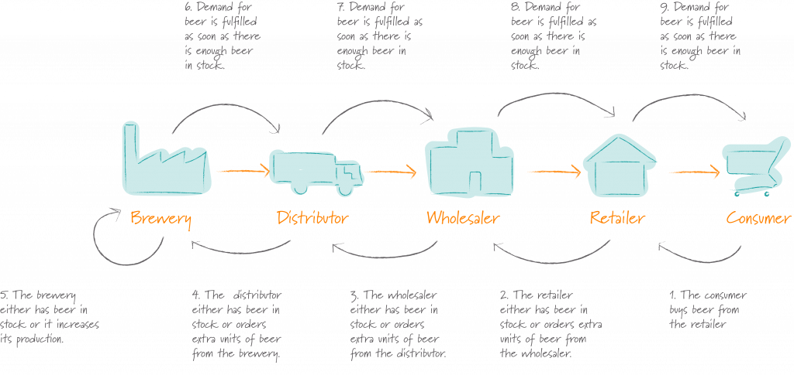

# se-01-team-33

SE Sprint 01, Team 33

## **Introduction**

1. ### **General Ideas**

The beer game is based on supply chain and involves 4 players where each player represents one of the four stages in the chain i.e the retailer, the manufacturer, the wholesaler, the consumer.

Every week the retailer receives orders from the consumer without any time delay. The retailer fulfills as many unit of beer order as it can and then calculates the number of units that are required based on the total number of stocks left in the inventory, the cost of each beer, and the backlog.

After some time delay, the retailer places an order to the wholesaler. The wholesaler tries to fulfill the demand of the retailer and estimates how much beer is needed. The holesaler places an order to the distributor if he senses he is in need of more stocks. This process is repeated with the manufacturer as well.

Lastly, the manufacturer begins production according to the order demand. When the production is over, the beer is send backwards to the distributor, then from the distributor to the holesaler, retailer, and finally to the consumer. There are time delays in each step during the downstream process, except between the retailer and consumer.

2. ### **Goals and Objectives**

The objective of the game is to receive orders and deliver the items back to the consumer, in a way the maximizes profits and minimizes the total cumulative cost of all stages based the given information. Cost can be arisen from numerous places. There is a cost for holding the inventory, a cost for not satisfying demand so called a ”back order” which is basically a cost that is incurred until the demand for the product is satisfied.

### Diagram to demonstrate the Supply Chain and and the flow of information

## **Requirements**

1. ### **User**
   The user can be logged in as a student or as an instructor. Each of these roles have their own requirements.

1.1 **Instructor**

- The instructor acts as as an administrator of the game.
- One should be able to modify the input parameter, record every players individual performance and see the summary of the game results.
- The instructor must be able to set the initial values for the following parameters prior to the start of each game.
  1. Number of rounds, weeks per game
  2. Time delay for both upstream and downstream
  3. Initial number of items in inventory of each stakeholder
  4. The backlog and the cost of each item in stock
  5. The amount of information available to each stakeholder can view in the game
- The instructor must be able to supervise the current state of each game during a session.
- The instructor must be able to change the type of demand for the players.
- The instructor and user must be able to view a plot showing the bullwhip effect and player demand versus demand generated.

  1.2 **Player**  
  Once the lobby and game setting are initialised by the instructor players can join the lobby.

- A player should be able to decide on his/her role be able to choose a role of Retailer, Wholesaler, Distributor, or Factory.
- A player shall be able to place orders to the upstream supply chain.
- The players are not allowed to discuss or talk about their own strategies with each other. Players can only view the following:
  1. The backlog of orders that couldn’t be fulfilled.
  2. Incoming orders from the upstream
  3. Number of stocks in the inventory
  4. Updated information after the orders have been placed.

There are 24 rounds of the game and in each round the player performs the following 4 steps.  
1\. **Check Deliveries** Check the quantity of beer units that are delivered to the downstream supplier in the supply chain within some time delay.  
2\. **Check Incoming Orders** Check the quantity of beer units that the downstream supplier has ordered within some time delay.  
3\. **Deliver Beer** To satisfy the consumer demand, deliver as many units as possible.  
4\. **Place Out going Order** This is the decision-making process where the number of units of beer needed are decided to keep the inventory going and ensure that he has sucient units to meet future demands. The decision is based on 3 factors namely backlog, consumer needs, and current stock.

2. ### **System**
   Following are the system requirements that must be kept it when creating the game. Please note that there maybe other requirements as well however these are the major ones that need be talked upon and the foundation through which the game should be created.

1\. When first opening app user (who could either be a player or an instructor) should be presented with the options to login or to register.

2\. A player should only be able to play a game which is has been created by some instructor.

3\. There can only be one instructor for one session or game that is happening after which he will receive a unique code only for that session.

4\. User can only join the game by typing the unique code after which he should automatically be assigned the role of a player.

5\. A player should only be active in one session.

6\. All players and instructor should have their own unique id to identify them.

7\. When the game reaches the maximum number of weeks, it should terminate and present players with a final interface which displays the saved game statistics.

8\. Players should be able to choose a valid role (Factory, Distributor, Wholesaler and Retailer) that they must stick to and cannot be changed.

9\. After each round the system should be able to show the player the demand from the successor, the incoming beers from the predecessor, the number of beers in warehouse, the back log and input field to place the order.

10\. Certain settings such as holding costs or beer costs cannot be changed by the instructor once the game has started but certain settings such as number of rounds should be able to change once the game has instructed. The system should be able to handle such functionalities.

11\. The instructor should be able to inspect each game in the session while it is ongoing and after the game has ended the instructor should be able to see weekly analysis after each round.

12\. When the game reaches the maximum number of weeks, it should terminate and present players with a final interface which displays the saved game statistics.

3. ### **Setup and Deployment**

4. ### **Conclusion**

The goal of this game is to teach students who use this software about **The Bullwhip Effect** which is a supply chain phenomenon describing how small fluctuations in demand at the retail level can cause progressively larger fluctuations in demand at the wholesale, distributor, manufacturer and raw material supplier levels. The effect is named after the physics involved in cracking a whip. When the person holding the whip snaps their wrist, the relatively small movement causes the whip’s wave patterns to increasingly amplify in a chain reaction.

The purpose of this document is for developers to have a guideline to follow and know procedures about how to do your coding instead of just starting form scratch. The ideas presented above teach you with general conceptual modeling of the structure of the application, and for detailed modeling translating the models into programming code.

# **Contributions**:

Date: 9.3.2021 **Sprint 1**  
README: introduction, requirements, conclusion  
Web-setup:
